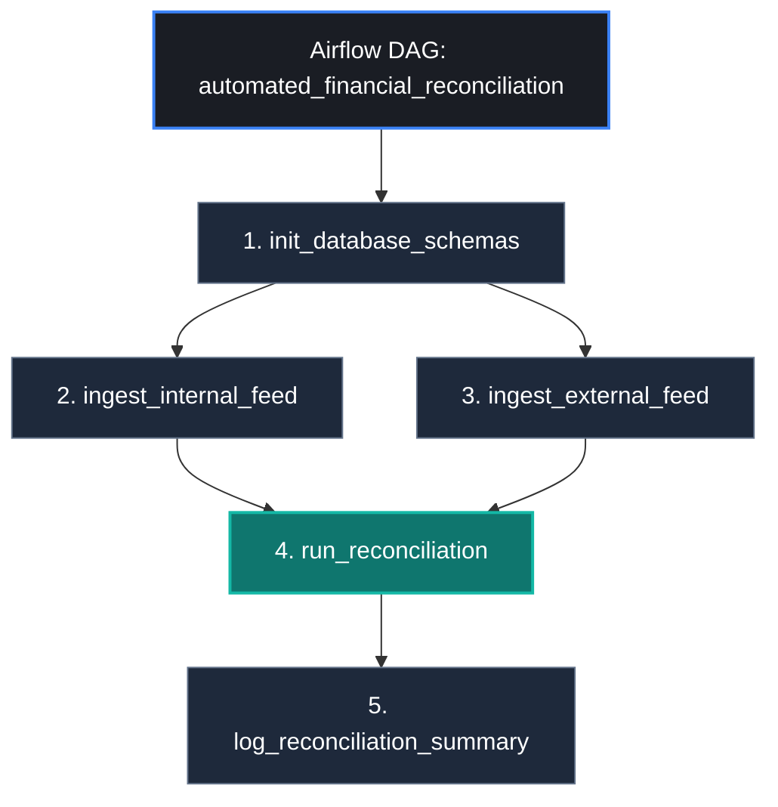

# Automated Financial Reconciliation Pipeline

An enterprise-grade financial data pipeline orchestrating daily cross-system reconciliation between core ledger balances and external payment gateway clearing feeds using **Apache Airflow**, **PostgreSQL**, and **Docker**.

---

## Architecture Flow



---

## Core Technical Features

* **Orchestration & Idempotency:** Managed via Airflow `LocalExecutor` with atomic transaction imports (`ON CONFLICT DO NOTHING`).
* **Reconciliation Engine:** High-performance SQL Full Outer Join flagging:
  * `AMOUNT_MISMATCH`: Deviation between billed and settled amounts (fees, FX, charge slips).
  * `MISSING_IN_GATEWAY`: Internal charges lacking clearing confirmation from the external processor.
  * `MISSING_IN_INTERNAL_LEDGER`: Gateway charges lacking internal journal logs.
* **Audit Ledger:** Partition-ready table (`reconciliation_audit`) indexing batch execution dates and classified discrepancies.

---

## Project Structure

```text
financial-reconciliation-pipeline/
├── dags/
│   └── reconciliation_dag.py        # Core Airflow DAG definition
├── data/
│   ├── generate_mock_data.py        # Feed generator simulating anomalies
│   ├── internal_feed.csv            # Ledger transactions
│   └── external_feed.csv            # Payment gateway logs
├── sql/
│   ├── schema.sql                   # DDL table schemas
│   └── reconciliation.sql           # Full Outer Join audit query
├── tests/
│   └── test_reconciliation.py       # DAG integrity & anomaly logic tests
├── docker-compose.yml               # Airflow + PostgreSQL stack
├── requirements.txt
└── README.md
```

---

## Setup & Execution

### 1. Launch Environment
```bash
docker compose up -d
```

### 2. Configure Airflow Database Hook
```bash
docker compose exec airflow-webserver airflow connections add "postgres_default" \
  --conn-type "postgres" \
  --conn-host "postgres" \
  --conn-login "airflow" \
  --conn-password "airflow" \
  --conn-schema "airflow" \
  --conn-port 5432
```

### 3. Generate Datasets
```bash
python data/generate_mock_data.py
```

### 4. Trigger Reconciliation DAG
```bash
docker compose exec airflow-webserver airflow dags trigger automated_financial_reconciliation
```

### 5. Inspect Audit Discrepancies
```bash
docker compose exec postgres psql -U airflow -d airflow -c "SELECT discrepancy_type, COUNT(*) FROM reconciliation_audit GROUP BY discrepancy_type;"
```